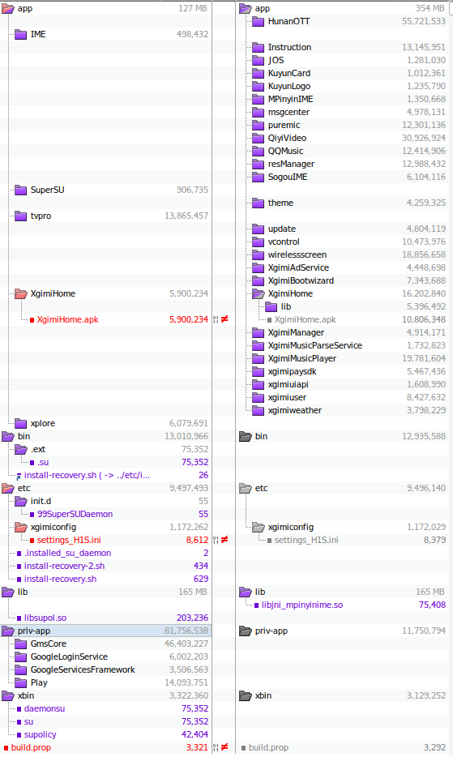
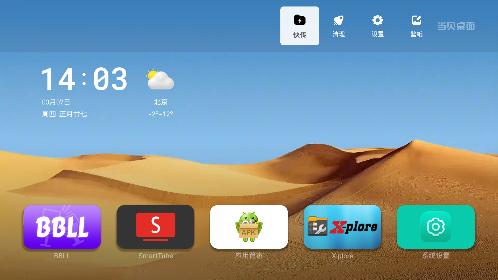
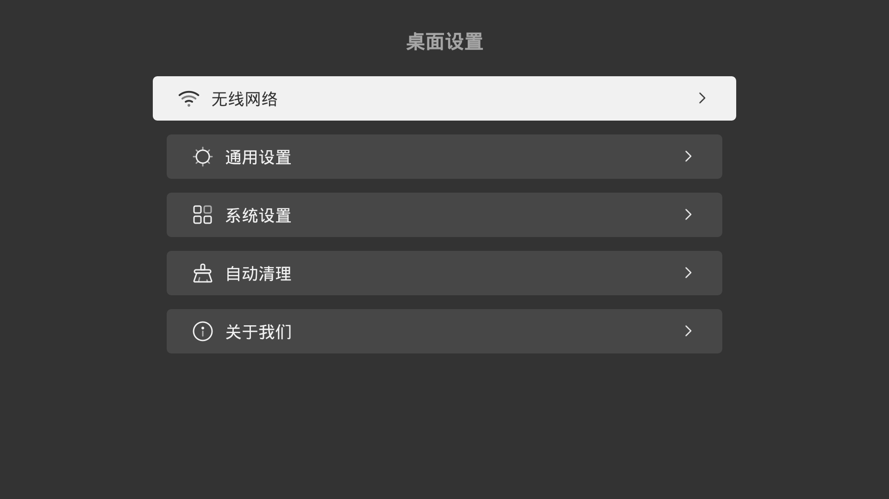
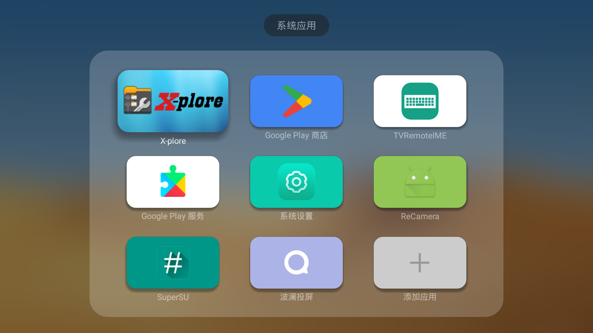
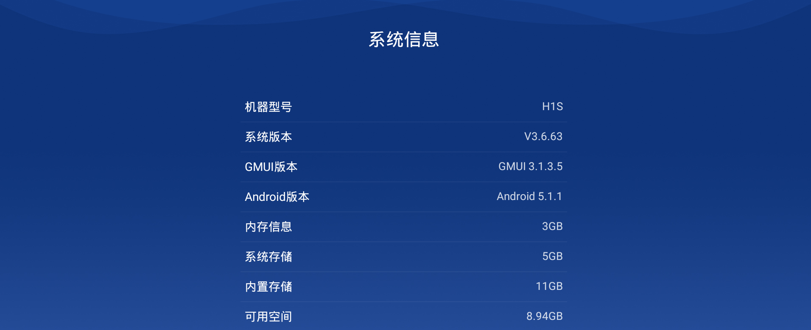
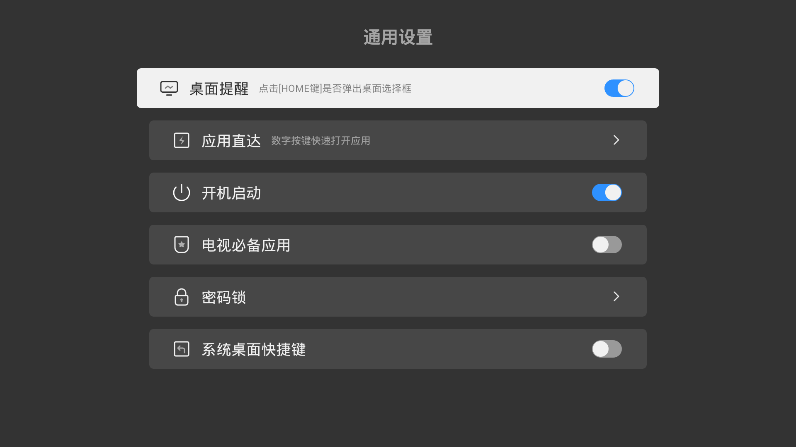
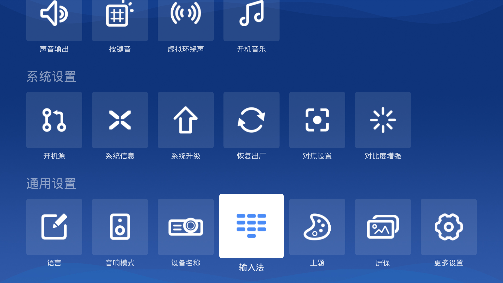
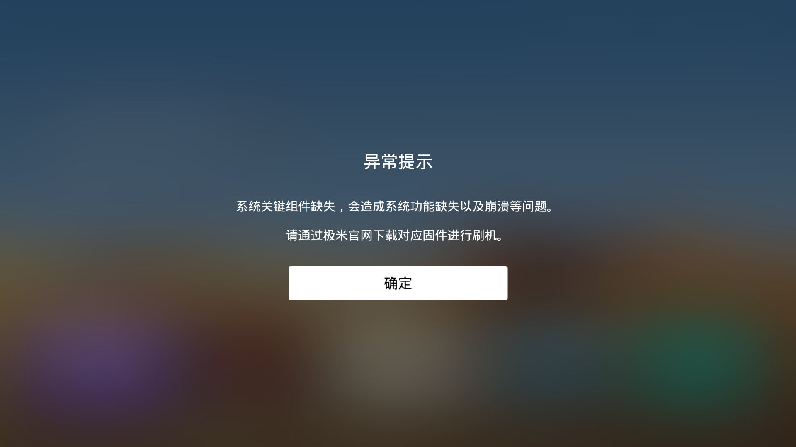

# xgimi_h1s_root
root and purge ur xgimi H1S, base on offical rom 3.6.63

## features
- root: SuperSU.Pro-2.82-SR5-ultra
- purge: remove shit build-in app such as QiyiVideo mango HunanOTT,see dif
- turn on adb
- show the input method selector in settings
- gplay
- dangbei tv launcher 4.17: remove ad
- tvpro cast 4.1
- feature can choose

## dif offical

## Screenshots

### ignore it

## how to
run runme.bat
or
download [rom](https://1drv.ms/f/s!AiRIOqEFt9zVgugwp_JsN_i0U6eeLw?e=DKOyZP) to flash

# Acknowledgements
